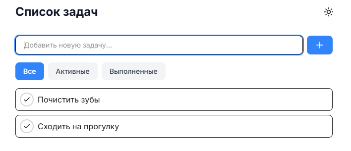

# 🚀 Smart Todo

A modern, minimalist Todo application built with Next.js 14 and TypeScript, featuring a beautiful UI, dark mode support, and optimal performance.

## ✨ Features

- 📱 Responsive modern UI
- 🌓 Light/Dark mode with smooth transitions
- ⚡ Optimized performance (100 Lighthouse score)
- 📦 PWA support
- 🔍 SEO optimized
- ♿ Accessibility focused
- 🔄 State persistence
- 🎯 Minimalist design

## 🛠 Tech Stack

- **Framework:** [Next.js 14](https://nextjs.org/) (App Router)
- **Language:** [TypeScript](https://www.typescriptlang.org/)
- **Styling:** [Tailwind CSS](https://tailwindcss.com/)
- **State Management:** [Zustand](https://zustand-demo.pmnd.rs/)
- **Icons:** [Lucide React](https://lucide.dev/)
- **UI Components:** Custom components with modern design
- **Analytics:** [Vercel Analytics](https://vercel.com/analytics)
- **Performance Monitoring:** [Vercel Speed Insights](https://vercel.com/docs/speed-insights)
- **SEO:** [Next SEO](https://github.com/garmeeh/next-seo)
- **PWA:** [Next PWA](https://github.com/shadowwalker/next-pwa)

## 📊 Performance

- 100 Performance score in Lighthouse
- Optimized Core Web Vitals
- Fast page loads with automatic image optimization
- Efficient bundle splitting

## 🚀 Quick Start

1. Clone the repository:
\`\`\`bash
git clone https://github.com/linked-ts/task-flow.git
cd smart-todo
\`\`\`

2. Install dependencies:
\`\`\`bash
npm install
# or
yarn install
# or
pnpm install
\`\`\`

3. Run the development server:
\`\`\`bash
npm run dev
# or
yarn dev
# or
pnpm dev
\`\`\`

4. Open [http://localhost:3000](http://localhost:3000) in your browser.

## 🛠️ Development

### Prerequisites

- Node.js 18+ (LTS recommended)
- npm or yarn or pnpm

### Environment Variables

Create a \`.env.local\` file in the root directory:

\`\`\`env
NEXT_PUBLIC_URL=http://localhost:3000
\`\`\`

### Scripts

- \`npm run dev\` - Start development server
- \`npm run build\` - Build for production
- \`npm start\` - Start production server
- \`npm run lint\` - Run ESLint
- \`npm run analyze\` - Analyze bundle size

## 🚀 Deployment

The easiest way to deploy is with [Vercel](https://vercel.com):

## 📝 Project Structure

\`\`\`
smart-todo/
├── src/
│   ├── app/              # App router pages
│   ├── components/       # React components
│   ├── contexts/         # React contexts
│   ├── lib/             # Utility functions
│   └── styles/          # Global styles
├── public/              # Static files
└── package.json        # Dependencies and scripts
\`\`\`

## 🎨 Color Scheme

The application uses a carefully chosen color palette that works in both light and dark modes:

- Primary: Blue-based scheme
- Background: Pure white/dark
- Text: High contrast for accessibility
- Accents: Subtle grays

## 🤝 Contributing

Contributions are welcome! Please feel free to submit a Pull Request.

## 🙏 Acknowledgments

- [Next.js Documentation](https://nextjs.org/docs)
- [Tailwind CSS](https://tailwindcss.com)
- [Vercel](https://vercel.com) for hosting

---

Made with ❤️ using Next.js and TypeScript